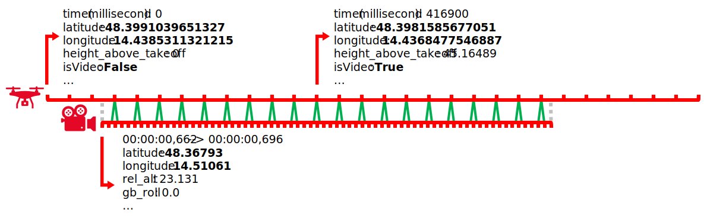
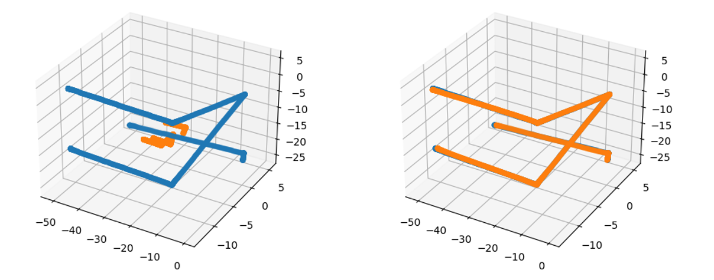
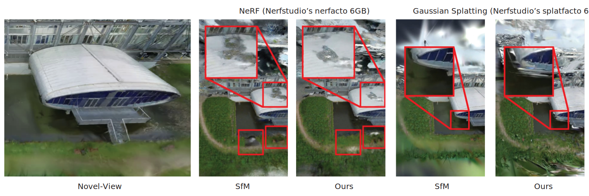

[](https://doi.org/10.1145/3641234.3671077) [](https://bambi-eco.github.io/RARF)

# Reconstructionless Airborne Radiance Fields

Christoph Praschl, Leopold Böss, David C. Schedl

This repository contains the official authors implementation associated with the paper "Reconstructionless Airborne Radiance Fields", which can be found [here](https://doi.org/10.1145/3641234.3671077) published at [SIGGRAPH 2024](https://s2024.siggraph.org/).


_Abstract: For a few years now, radiance fields and especially neural radiance fields (NeRF) represent a cutting-edge advancement in computer graphics, enabling the generation of high-quality novel views for scenes captured from various angles through multiple photos or videos. Instead of traditional methods that rely on geometric representations or explicit scene meshes, NeRF leverages neural networks to directly model the volumetric scene function. Like this, the approach has dramatically transformed the landscape of novel-view synthesis, offering unprecedented realism and flexibility in rendering complex scenes. However, the training of NeRF models is typically based on computationally intensive image-based reconstructions of camera positions and visual features of the addressed scenes using Structure from Motion (SfM). In airborne imaging, camera poses are already explicitly available by exact global navigation satellite systems (i.e., GPS) and internal sensors of aerial vehicles. In this work, we introduce a novel processing pipeline designed to effectively harness image and sensor data captured by uncrewed aerial vehicles (UAVs) to train NeRF-like models without needing SfM._

## Overview

The proposed pipeline relies on automated UAV flights utilizing DJI-manufactured devices. These UAVs are equipped to capture (multi-spectral) image/video data while simultaneously logging the camera extrinsics based on global positions and global orientations of both the drone and the camera gimbal. The global position is expressed as WGS84 coordinates consisting of longitude, latitude, and altitude.

DJI utilizes the sub rip text (.srt) data format to log meta information at 29.97 Hz for video recordings, encompassing the mentioned global camera position and orientation next to additional information per video frame. However, the position data is limited to 5-digit precision, approximately leading to a 1 m spatial precision. Yet, there exists a proprietary flight log file offering higher spatial precision using a 13-digit representation albeit at a 10 Hz frequency for the whole flight (can be accessed using tools like [Airdata](https://airdata.com/)) -- also including periods with no video recordings, such as the start of the drone, flying to the first waypoint, returning to the home position, and landing. When flying with a typical flight speed of 5 m/s the low frequency of the flight log is not sufficient, since it would result in approximately one position every 50 cm. To attain precise global positioning data for the camera's extrinsic parameters of every individual video frame, we synchronize both files based on available timestamps and an optimization that minimizes the overall distances between the 13- and 5-digit  positions. Afterward, we use linear interpolation to impute missing high-precision values at 29.97 Hz, allowing us to make use of the high precision and especially the high accuracy offered by real-time kinematics, resulting in an accuracy of 1/1.5 cm + 1 ppm, horizontally and vertically (cf. DJI's specification). In combination with camera intrinsics from a previous calibration, the so created camera extrinsics are suitable as basis for training novel view synthesis models like NeRF or Gaussian Splatting.




## Evaluation 

To assess our method, we reconstruct camera poses with SfM and compare it to our pipeline to use it as input for scene synthesis using two NeRF-like models implemented in Nerfstudio: NeRF and Gaussian Splatting. We conducted three UAV flights with a speed of 3 m/s and the same starting point, recording RGB videos at 29.97 FPS, each flight pointing the camera on a central elliptical building over a water surface from different perspectives: a frontal view at 0°, a diagonal view at 45°, and a nadir view with a 90° gimbal pitch. This initial dataset consists of 2561 frames (4K resolution), which are undistorted, scaled down and cropped to 1024 * 839 pixels using the camera's intrinsics from previous SfM-based calibrations, as well as resampled to 10 FPS (854 images) and 2 FPS (171 images). 

For the SfM-based reconstruction, we employ Colmap 3.7 with default settings to extract SIFT features, perform exhaustive feature matching, and generate a sparse 3D model using its mapper based on the created initial dataset. Conversely, our airborne processing pipeline is used for reading and synchronizing the log files of the flights, enabling direct reconstruction of camera extrinsics. Both approaches are executed with precise timing measurements. Subsequently, we convert the created sparse models for the 10 FPS dataset from COLMAP's format to Nerfstudio's JSON representation and train NeRF-like models for additional visual comparison. 


## Results

The evaluation is executed on a Windows 10 system with an AMD Ryzen Threadripper 2990WX CPU, four Nvidia RTX 2080 GPUs, and 128 GB RAM. The SfM-based reconstruction requires 511.273 min for the 10 FPS dataset, with 0.25 min for feature extraction, 7.477 min for the exhaustive matching, and 503.546 min for the actual reconstruction. For the 2 FPS dataset, the process requires 9.916 min, which consists of 0.066 min for feature extraction, 0.294 min for feature matching, and 9.556 min for the reconstruction. In comparison, our pipeline utilizes the log files created by the drone in flight. This conversion process takes 2.54 sec for the 10 FPS dataset and 2.48 sec for the 2 FPS version.

Both techniques result in similar camera poses with slight variations. To quantify the difference, we transformed the SfM-based poses to our extrinsic, using iterative-closest-point matching with a rigid-body transformation (including scaling), and computed the mean difference of corresponding camera positions, leading to average differences of 0.39 and 0.11 m for the 2 and 10 FPS dataset, respectively. 



The qualitative comparison of the trained NeRFs (Nerfstudio's nerfacto model in the default 6GB size) shows comparable qualities of the synthesized novel views using ours and the SfM-based reconstruction with both e.g., having problems in the roof area or the meadow in front of the building. However, with Gaussian Splatting (Nerfstudio's splatfacto model in the default 6GB size), SfM-based reconstruction presents notable advantages (e.g. bottom left corner of the building) owing to the presence of reconstructed sparse 3D points as seed information in the SfM reconstruction only. In contrast, our method relies on randomly initialized geometries



<video>
<source src="https://zenodo.org/records/12743840/preview/uas.mp4" type="video/mp4">
</video>

### Additional scene

In addition to the scene described in the research paper, we have prepared another novel view synthesis scene showing comparable results:

<video>
<source src="https://zenodo.org/records/12743840/preview/church.mp4" type="video/mp4">
</video>

## Material

The used videos and log files are published on [Zenodo](https://zenodo.org/records/12743840) as replication package.

## Conclusion

Using the presented approach, we can train NeRF-like models based on precomputed camera intrinsic and the recorded camera extrinsic from the UAV. Compared to the conventional SfM-based reconstruction process, we reconstruct an airborne scenery with considerably improved performance (our preprocessing is four orders of magnitude faster for 854 images) and comparable or slightly worse quality (depending on the underlying NeRF-like model). In addition, this process allows us to have a data preparation for airborne recordings with linear runtime (based on the flight log) instead of exponential runtime required in SfM to match all individual features of the images. Additionally, our approach is independent of visual features. Like that, our pipeline should also work out with the recorded thermal videos from the used multi-spectral cameras. Initial experiments indicate that SfM cannot be used with that data.


|                      | SfM                                     | Ours                        |
|----------------------|-----------------------------------------|-----------------------------|
| Runtime Complexity   | Exponential                             | Linear                      |
| Runtime (854 images) | 511 min                                 | 2.54 sec                    |
| Quality              | Ground Truth                            | Comparable / slightly worse |
| Features             | Intrinsics, Extrinsics, Sparse 3D model | Extrinsics                  |


## Bibtex

```
@inproceedings{rarf,
    author = {Praschl, Christoph and B{\"o}ss, Leopold and Schedl, David C.},
    title = {Reconstructionless Airborne Radiance Fields},
    year = {2024},
    publisher = {Association for Computing Machinery},
    address = {New York, NY, USA},
    url = {https://doi.org/10.1145/3641234.3671077},
    doi = {10.1145/3641234.3671077},
    booktitle = {ACM SIGGRAPH 2024 Posters},
    location = {Denver, CO, USA},
    series = {SIGGRAPH '24}
}
```

## Funding and Acknowledgments

This research is funded by the Austrian Research Promotion Agency FFG (project _[BAMBI](http://www.bambi.eco/); program number: 892231) within the funding program Ai4Green, for which the budget is provided by the Federal Republic of Austria. 

